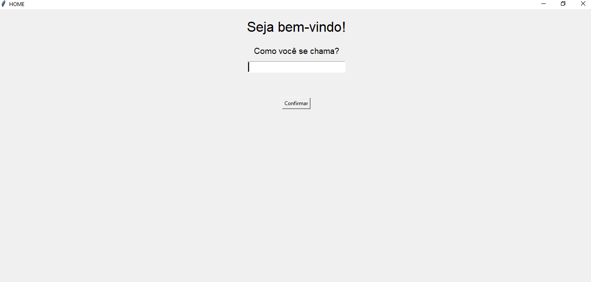
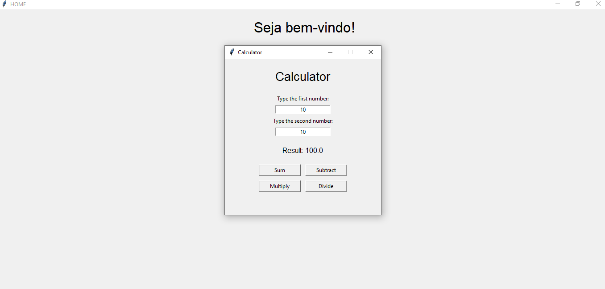

# Python Mini Apps

A small desktop app built with Python and Tkinter. It opens a welcome screen, asks for the user's name, and then shows a menu of mini-programs. Right now it includes a calculator, with more tools planned.

## Features

- Welcome screen that greets the user by name
- Calculator in its own window: addition, subtraction, multiplication and division
- Input validation: invalid numbers and division by zero show a message instead of crashing
- Calculator logic lives in a separate module, apart from the main window

## Screenshots




## Requirements

- Python 3
- Tkinter (included in the standard Python installers from python.org; on Debian/Ubuntu install it with `sudo apt install python3-tk`)

No external packages are needed.

## How to run

```bash
git clone https://github.com/IsaacP21santos/Python.git
cd Python
python main.py
```

On some systems the command is `python3` or `py` instead of `python`.

## Project structure

```
Python/
├── main.py            # main window (home screen)
├── calculadora.py     # calculator window
├── screenshots/       # images used in this README
└── README.md
```

## Roadmap

- [x] Home screen
- [x] Calculator
- [ ] Number guessing game
- [ ] More tools
